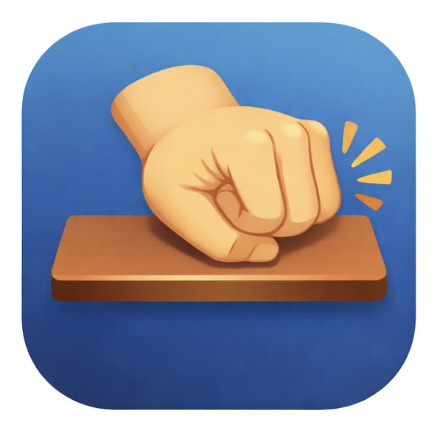

<p align="center">
  
</p>

<h1 align="center">KnockKnock</h1>

<p align="center">
  Detect desk taps with your MacBook's built-in accelerometer and trigger system actions.
</p>

<p align="center">
  
  
  
</p>

---

## What is KnockKnock?

KnockKnock turns your MacBook into a tap-sensitive automation tool. Tap your desk — and your Mac responds. No external hardware, no special setup — just your MacBook and your fingertips.

Your Apple Silicon MacBook has a built-in accelerometer that most people don't even know about. KnockKnock uses this hidden sensor to detect physical taps on your desk and translate them into system actions.

- **2 taps** — Play/Pause media
- **3 taps** — Next track
- **4 taps** — Launch an app
- **5+ taps** — Whatever you want — fully customizable up to 7 taps

Every tap pattern is configurable. Map them to media controls, app launches, keyboard shortcuts, or any combination you like.

Inspired by [SlapMac](https://github.com/nickytonline/SlapMac) — a fun idea of interacting with your Mac through physical gestures.
<br>
## Install

### Homebrew (recommended)

```bash
brew tap MoonDongmin/knock-knock
brew install --cask knock-knock
```
<br>

### Manual

Download the latest `.dmg` from [Releases](https://github.com/MoonDongmin/knock-knock/releases).
<br>
### macOS Gatekeeper notice

On first launch, macOS may show **"KnockKnock is damaged and can't be opened."** This happens because the app is not code-signed with an Apple Developer certificate. The app is completely safe — you can review the full source code in this repository.

To fix this, run the following command after installation:

```bash
xattr -cr /Applications/KnockKnock.app
```
<br>

## Requirements

- macOS 14 (Sonoma) or later
- Apple Silicon Mac (M1/M2/M3/M4)
- Administrator password (required for accelerometer access)

<br>

## Tech Stack


| Layer         | Technology                |
| ------------- | ------------------------- |
| App Framework | Tauri v2                  |
| Backend       | Rust (IOKit HID, CGEvent) |
| Frontend      | TypeScript + React        |
| UI            | Tailwind CSS              |
| Build         | Vite + Bun                |
<br>

## Development

```bash
# Install dependencies
bun install

# Run in development
bun run tauri dev

# Build for production
bun run tauri build

# Lint & format
bun run check
```
<br>

## Architecture

```
[IOKit HID ~800Hz] → [Rust: downsample 100Hz] → [Tauri Event] → [TS: TapDetector] → [ActionMapper] → [ActionExecutor]
```

Rust handles minimal hardware bridging (accelerometer access, key simulation). All business logic — tap detection, pattern matching, action mapping — lives in TypeScript.
<br>

## Feature Requests

Want a new tap action? Have an idea for a feature? [Open an issue](https://github.com/MoonDongmin/knock-knock/issues) — all suggestions are welcome!
<br>

## License

MIT
